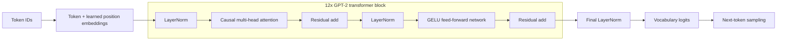

# GPT-2 Small (124M), Reimplemented from Scratch

This repository is a fresh PyTorch implementation of the original GPT-2 Small
architecture. It builds the full decoder-only language model from basic PyTorch layers,
reports exactly **124,439,808 trainable parameters**, and demonstrates the engineering path
from architecture to data streaming, training, checkpointing, validation, generation, and
GPU execution. Official GPT-2 weights are used for compatibility verification; random
initialization is used for the separate training proof.

## What this project proves

- **Implemented:** GPT-2 tokenization and packed next-token data, learned token and
  position embeddings, causal multi-head attention, custom LayerNorm, tanh-approximate
  GELU MLPs, residual blocks, tied output weights, loss, AdamW training, evaluation,
  checkpoint resume, and greedy/temperature/top-k generation.
- **Tested locally:** tensor shapes, causal isolation, gradients, weight tying, optimizer
  grouping, checkpoint restoration, deterministic sampling, streaming-data behavior,
  official-weight tensor mapping, and the exact parameter assertion.
- **Verified on an A100:** the 124M model completed a finite forward/backward smoke test
  and a separate three-update FineWeb-Edu training proof with validation, generation,
  checkpointing, and artifact persistence.
- **Runnable locally:** a deterministic CPU demo trains the test-sized debug configuration
  on synthetic token IDs and generates a short token sequence in a few seconds.
- **Not claimed:** the randomly initialized model has not been pretrained long enough to
  produce useful language. The three-step run is a systems test, not a quality result.

## Architecture at a glance

| Property | GPT-2 Small value |
| --- | ---: |
| Transformer blocks | 12 |
| Attention heads | 12 |
| Dimensions per head | 64 |
| Embedding dimension | 768 |
| MLP hidden dimension | 3,072 |
| Context length | 1,024 tokens |
| Vocabulary | 50,257 tokens |
| Trainable parameters | **124,439,808** |

The output projection shares the token-embedding parameter, matching GPT-2 weight
tying. Each block uses GPT-2's pre-LayerNorm ordering and causal attention.



## Features

- Official `tiktoken` GPT-2 BPE with explicit `<|endoftext|>` support.
- Lazy FineWeb-Edu streaming with stable SHA-256 train/validation assignment and
  continuity-preserving sequence packing.
- GPT-2-compatible module and parameter names for fused QKV and official-weight import.
- GPT-2-style initialization, tied input/output token weights, and raw vocabulary logits.
- Cross-entropy evaluation, AdamW parameter grouping, gradient clipping, local training
  history, and reproducible checkpoint state.
- Greedy, temperature, and top-k autoregressive generation with context cropping.
- Bounded tiny-training workflow with metrics, final checkpoint, generated sample, and a
  machine-readable summary even on failure or timeout.

## Project structure

```text
src/gpt2_124m/
  attention.py          causal single-head and fused multi-head attention
  checkpoint.py         serializable save/load and reproducible local resume
  config.py             immutable model and training configurations
  data.py               reusable token-window dataset
  embeddings.py         token and learned position embeddings
  fineweb.py            lazy FineWeb-Edu split, tokenization, and packing
  generation.py         greedy, temperature, and top-k generation
  gpt2_weights.py       official GPT-2 weight mapping and comparison
  layers.py             LayerNorm, GELU MLP, and transformer block
  model.py              complete tied-weight GPT-2 language model
  tiny_pretraining.py   bounded artifact-producing training proof
  tokenizer.py          thin wrapper around tiktoken's GPT-2 encoding
  training.py           loss, evaluation, AdamW, steps, and local loop
scripts/                local demo, preflight, CUDA smoke, and tiny-training entry points
configs/                tiny-run and dependency/runtime configuration
tests/                  offline-focused unit and integration tests
docs/                   data, VESSL, experiment, and interview documentation
```

## Local setup and verification

The project supports Python 3.10 and 3.11; local development uses Python 3.11.

```bash
git clone https://github.com/Uzbekswe/gpt2-124m-from-scratch.git
cd gpt2-124m-from-scratch
python3.11 -m venv .venv
source .venv/bin/activate
python -m pip install --upgrade pip
python -m pip install -e ".[dev]"

python -c "import gpt2_124m; print(gpt2_124m.__version__)"
python -m pytest
python -m ruff check .
```

Ordinary package imports and offline tests do not require Hugging Face `datasets`,
Transformers, VESSL, network access, or a GPU. The full default model uses roughly 0.5 GB
for float32 parameters alone, so the test suite uses a clearly named debug configuration
for most behavioral checks while retaining a production parameter-count test. The local
verification gate currently completes with **174 passed, 1 optional online test skipped**, and
Ruff passing. GitHub Actions runs the same checks on Python 3.10 and 3.11.

## Fast local demo

The fastest way to see the package train and generate is the deterministic CPU demo. It uses
`GPT2_DEBUG_CONFIG` and synthetic token IDs, so it is a smoke demonstration rather than a
language-quality result:

```bash
python scripts/local_demo.py
```

For the exact 124M model's structural proof, use the production parameter-count test or the
GPU smoke command below. The full model requires substantially more memory than the debug demo.

## Smoke and tiny-training commands

The CUDA smoke script creates the exact model, runs one short forward/backward pass, checks
finite loss and gradients, and writes `smoke_report.json`. It requires a CUDA GPU and does
not update weights:

```bash
python scripts/vessl_smoke.py --output-dir artifacts/smoke
```

The tiny-training entry point uses the real streamed FineWeb-Edu pipeline. It requires
Hugging Face network access and is intentionally configured for only three optimizer
updates; a CUDA GPU is strongly recommended for the full 124M model.

```bash
python -m pip install -e ".[train]"
python scripts/tiny_pretrain.py \
  --config configs/tiny_pretrain.json \
  --output-dir artifacts/tiny-pretrain \
  --max-runtime-seconds 180
```

It writes `training_config.json`, `metrics.jsonl`, `checkpoint_final.pt`,
`generated_sample.txt`, and `training_summary.json`. These generated files are ignored by
Git. See the [FineWeb-Edu pipeline notes](docs/FINEWEB_EDU_DATA.md) for splitting, packing,
and attribution details.

## Official GPT-2 compatibility

The importer maps an official `openai-community/gpt2` state dictionary into these custom
classes, including the Conv1D-to-`nn.Linear` matrix transposes, and compares float32 logits
and deterministic greedy token IDs. Offline tests validate the complete mapping with
synthetic tensors; the networked comparison is opt-in because it downloads the reference
checkpoint.

```bash
python -m pip install -e ".[dev,verify]"
RUN_OFFICIAL_GPT2_INTEGRATION=1 \
  python -m pytest tests/test_official_gpt2_integration.py -q
```

Official weights are used only for compatibility verification, not to implement this
model or to represent independently trained weights. Downloaded weights and caches must
not be committed.

## VESSL Cloud evidence

The Cloud work ran in a private VESSL scope on NVIDIA A100-SXM4-80GB hardware:

- A smoke job verified the exact parameter count plus finite loss and gradients, then
  persisted its report.
- A clean tiny-training job succeeded in **1m 3s** total Cloud duration; its script ran for
  **22.02s**, completed three optimizer updates, evaluated validation loss, generated a sample,
  and persisted all five expected artifacts.
- An earlier attempt completed its application work but exposed a native interpreter
  finalization fault. The clean verification used explicit iterator cleanup, pinned
  streaming dependencies, bounded installation/deadline controls, and a batch-only clean
  exit after successful artifact writes.

The measured losses are recorded as execution evidence, not as a model-quality claim.
Read the full [A100 tiny-pretraining experiment report](docs/experiments/15c-vessl-a100-tiny-pretraining.md)
for the results, failure analysis, reproduction boundary, and limitations. The checkpoint
is a private Cloud artifact; it is not committed or offered as a public model download.

## Limitations and responsible claims

- Three optimizer steps cannot produce a useful language model; the generated text is
  expected to be essentially random.
- This work does not reproduce OpenAI's WebText data, training token count, compute budget,
  or published GPT-2 quality.
- The optional online compatibility check requires downloading the official checkpoint;
  the default offline test run does not perform that download.
- FineWeb-Edu streaming depends on Hugging Face availability and its ODC-By attribution
  requirements.
- Cloud artifacts and credentials remain outside this repository.

For a guided walkthrough, use the [5–7 minute interview demo](docs/INTERVIEW_DEMO.md).

For project history and the explicit boundary between completed work and future expansion, see
the [portfolio scope and project status](PLAN.md). Third-party references and licenses are
listed in [ATTRIBUTION.md](docs/ATTRIBUTION.md); this repository's code is released under the
[MIT License](LICENSE).

## Optional future work

The core architecture and end-to-end training proof are complete. Future extensions are
deliberately separate from this cleanup: a budgeted longer pretraining run, mixed precision,
scheduled learning rates, durable stream-position resume, original training charts, a model
card for released weights, and an interactive inference demo. See [PLAN.md](PLAN.md) for the
current boundary.
